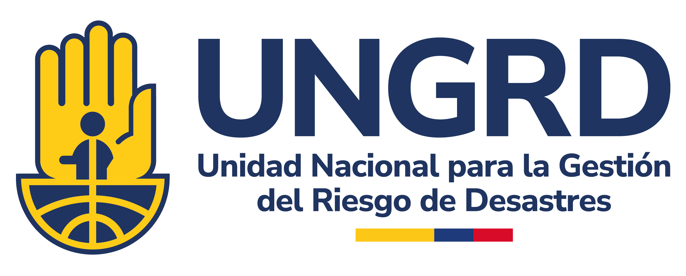

Memorias de Primera Plataforma Nacional para la Gestión del Riesgo de Desastres. Unidad Nacional para la Gestión del Riesgo de Desastres. Bogotá, D.C., 2026. DOI: <https://doi.org/10.5281/zenodo.21360641> 1. Conocimiento del riesgo de desastres 2. Reducción del riesgo de desastres 3. Manejo de desastres 

------------------------------------------------------------------------

::: {style="line-height: 0.96;"}
**Gustavo Petro Urrego** \| Presidente de la República

**Carlos Alberto Carrillo Arenas** \| Director General Unidad Nacional para la Gestión del Riesgo de Desastres (UNGRD)

**Rafael Enrique Cruz Rodríguez** \| Subdirector General

**Michael Oyuela Vargas** \| Secretario General

**Ana Milena Prada Uribe** \| Subdirectora para el Conocimiento del Riesgo

**María Constanza Meza Elizalde
** \|
​Subdirectora para la Reducción del Riesgo​

**Almirante José Ricardo Hurtado Chacón** \|
​Subdirector para el Manejo de Desastres​

------------------------------------------------------------------------

DOI: <https://doi.org/10.5281/zenodo.21360641>

<https://portal.gestiondelriesgo.gov.co/PN26>

Copyright: © Unidad Nacional para la Gestión del Riesgo de Desastres, Julio de 2026. Bogotá, Colombia

Todos los derechos reservados. Excepto si se señala otra cosa, la licencia del ítem se describe como Atribución. NoComercial-SinDerivadas 2.5 Colombia Distribución gratuita – versión digital
:::

{fig-align="center" width="300"}